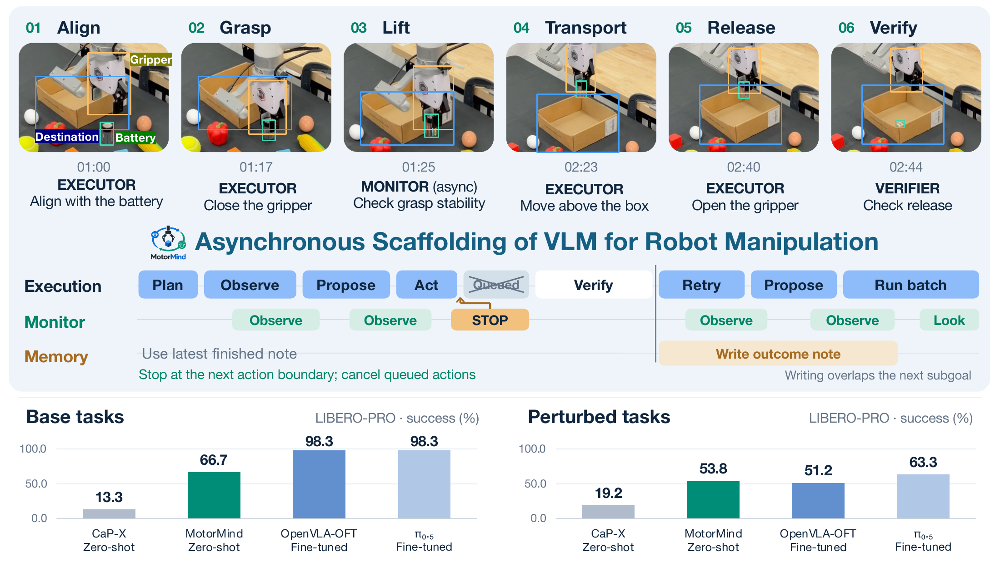

# MotorMind: Scaffolding General Vision Language Models for Zero-Shot Robot Manipulation**

MotorMind connects a frozen general-purpose vision-language model to robot control through mid-level actions and measured feedback. Concurrent monitoring and outcome verification support correction, recovery, and replanning without task-specific policy training.

## Code release

The code will be released before October 15. Stay tuned for the implementation and instructions for running MotorMind.
